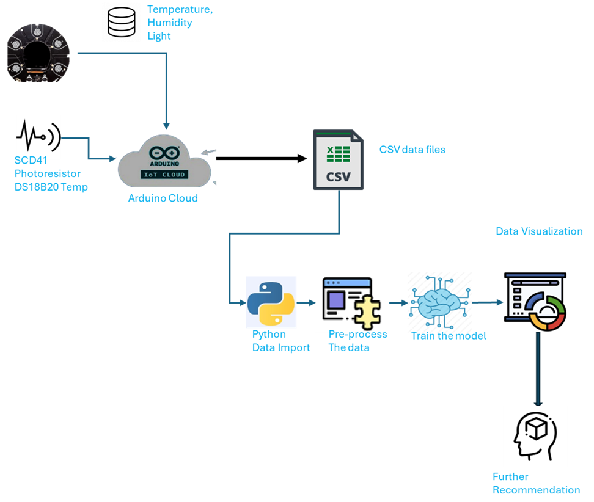

# 🌐 AdaptoSense – ANN-Based Sensor Fault Detection and Data Prediction

**AdaptoSense** is an AI-driven system designed for **real-time sensor fault detection** and **data prediction** in smart building environments. Developed using **Python**, **Arduino Cloud**, and **deep learning**, the system ensures data integrity and continuous monitoring by predicting missing or faulty sensor values using an **Artificial Neural Network (ANN)**.

---
## 🧠 Project Overview

**AdaptoSense** is a smart environmental monitoring system that integrates an **Arduino-based IoT sensor network** with a **custom Artificial Neural Network (ANN)**. The system continuously tracks and predicts key indoor environmental parameters:

- 🌡️ **Temperature**
- 💧 **Humidity**
- 🫁 **CO₂ Concentration**
- 💡 **Ambient Light Intensity**

In the event of a sensor malfunction or data transmission failure, the ANN accurately predicts the missing values. This ensures continuous, reliable environmental monitoring without system downtime.

### 📈 Conceptual Workflow



---

## ⚙️ System Overview

### ✅ Hardware Components
- Arduino MKR Wi-Fi 1010
- CO₂ Sensor (SCD41)
- Digital Temperature Sensor
- Photoresistor Sensor (Light)
- OPLA Weather Station
- Prototype Shield (for wireless communication)

### 💻 Software Stack
- **Arduino IDE** – Data acquisition and transmission
- **Arduino IoT Cloud** – Real-time sensor data logging
- **Python (Google Colab)** – ANN model training and prediction
- **Libraries**: `numpy`, `pandas`, `scipy`, `matplotlib`, `sklearn`

---

## 🧮 Neural Network Architecture

| Layer          | Configuration       |
|----------------|---------------------|
| Input Layer    | 7 nodes (features)  |
| Hidden Layer   | 70 nodes            |
| Output Layer   | 1 node (predicted)  |
| Activation     | Sigmoid             |
| Optimizer      | Gradient Descent    |
| Epochs         | 100                 |
| Loss Function  | Mean Squared Error  |

---

## 🔁 Workflow

1. **Sensor Data Collection**  
   Environmental data is collected every 5 seconds and stored in the Arduino IoT Cloud.

2. **Fault Simulation**  
   Specific sensors are manually disabled to simulate failure.

3. **Data Preprocessing**  
   Sensor values are normalized and filtered. Zero-value data is isolated for prediction.

4. **Model Training**  
   The ANN is trained using historical valid sensor data.

5. **Real-Time Prediction**  
   The model predicts missing sensor values with >95% accuracy.

---

## 📊 Performance Evaluation

| Scenario                     | Faulty Sensor   | Prediction Accuracy |
|-----------------------------|------------------|----------------------|
| Scenario 2                  | CO₂              | 95.0%                |
| Scenario 3                  | Light Sensor     | 95.9%                |
| Scenario 4                  | Humidity Sensor  | 99.99%               |
| Scenario 5                  | Temperature      | 99.99%               |

### 📈 Metrics
- **Relative Root Mean Square Error (rRMSE)**:  
  `0.023` *(example output, varies per run)*

- **Model Coefficient of Efficiency (C.E.)**:  
  `0.9994` *(very high predictive performance)*

---

## 📂 Repository Structure

```bash
AdaptoSense/
├── AdaptoSense_Model.py              # Final ANN implementation
├── AdaptoSenseProject Documentation.pdf
├── PresentationAdaptoSense.pptx
├── FinalNN_BTC.ipynb                 # Python training notebook
├── sensor_csv_files/                 # (CSV files used for training)
└── README.md                         # Project description and documentation

```

## 📦 Data

The project uses real-time sensor data collected from Arduino MKR Wi-Fi 1010 and OPLA Weather Station. All relevant data files are included in the `/data` directory.

### Included CSV Files
- `C3PO-humidity1.csv` – Indoor humidity sensor 1  
- `C3PO-carbon.csv` – Indoor CO₂ sensor  
- `C3PO-photoresistor.csv` – Light intensity (lux)  
- `C3PO-temperature1.csv` – Indoor temperature sensor 1  
- `C3PO-temperature_2.csv` – Indoor temperature sensor 2  
- `YodaThings-yodahumidity.csv` – External humidity (Yoda sensor)  
- `YodaThings-Yodatemperature.csv` – External temperature  
- `YodaThings-yodalight.csv` – External light conditions  

> 📁 These files are automatically loaded and preprocessed in the model for training and evaluation.
